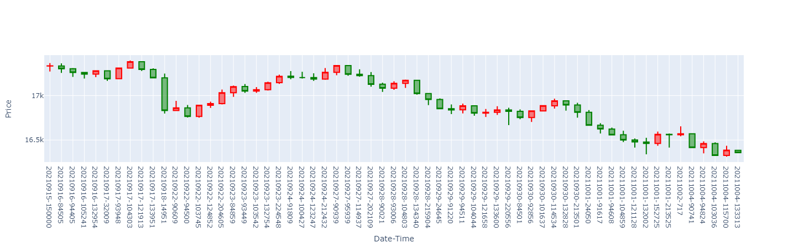

# Program HW1
## How to run?
Execute all the cell in the <font color="#f00">**ipynb file**</font>.
## Implementation Result
1. TX.csv的sample
    
    
2. Time Bar: 以天為單位
    
    
3. Tick Bar: 以10k個ticks為單位
    
    
4. Volume Bar: 以100k成交量為單位
    
    
5. Dollar Bar: 以1B成交⾦額為單位
    
    
## 繪製圖表使用ploty工具
```python
import plotly.graph_objects as go
candlestick = go.Candlestick(x=date,
                             open=#開盤陣列,
                             high=#最高點陣列,
                             low=#最低點陣列,
                             close=#收盤陣列)
fig = go.Figure(data=[candlestick])
fig.update_layout(xaxis_rangeslider_visible=False,xaxis_title='Date')
fig.update_layout(yaxis_title='Price')
fig.show()
```

## Code Explaination
### Problem1: Save the filtered dataset as “TX.csv”. The date, time, price, volume should be included.
>filter函數過濾篩選條件
```python
import os
import pandas as pd
def filter(df):
    df = pd.DataFrame(df,columns=["成交日期","商品代號","到期月份(週別)","成交時間","成交價格","成交數量(B+S)"])
    df['商品代號'] = df['商品代號'].str.strip()
    df['成交日期'] = df['成交日期'].str.strip()
    df['到期月份(週別)'] = df['到期月份(週別)'].str.strip()
    df['成交數量(B+S)'] = df['成交數量(B+S)'].str.strip()
    df=df[df["商品代號"] == "TX"]
    df=df[df["到期月份(週別)"] == "202110"]
    print(df.dtypes)
    return df

```
>輸出TX.csv
```python
import pandas as pd
dfs=[]
for f in os.listdir(os.getcwd()):
    if f.endswith('csv'):
        print(f)
        df=pd.read_csv(f, encoding='big5',dtype={"成交日期":object,"商品代號":object,"到期月份(週別)":object,"成交數量(B+S)":object})
        df=filter(df)
        df=df.rename(columns={'成交日期': 'date','商品代號':'id','到期月份(週別)':'expiration month','成交時間':'time','成交價格':'price','成交數量(B+S)':'volume'})
        dfs.append(df)
TX=pd.concat(dfs)
print(TX.shape)
TX.to_csv("TX.csv",encoding='big5')
```

### Problem2: Plot the time bar in the period of “1 Day”.
> 宣告開高低收list，並且根據Date分群
```python
open=[]
high=[]
low=[]
close=[]
date=["20210915","20210916","20210917","20210918","20210922","20210923",
        "20210924","20210925","20210927","20210928","20210929","20210930","20211001","20211002","20211004"]

for i in date:
        TX_Date=TX.groupby('date')
        print(TX_Date.size())
        TX_Date=TX_Date.get_group(i)
        #TX_Date=TX_Date.sort_values("time")
        open.append(TX_Date["price"].iloc[0])
        close.append(TX_Date["price"].iloc[-1])
        high.append(TX_Date["price"].max())
        low.append(TX_Date["price"].min())
```
>繪製圖表
```python
import plotly.graph_objects as go
candlestick = go.Candlestick(x=date,
                             open=open,
                             high=high,
                             low=low,
                             close=close)
fig = go.Figure(data=[candlestick])
fig.update_layout(xaxis_rangeslider_visible=False,xaxis_title='Date')
fig.update_layout(yaxis_title='Price')
fig.show()
```
)

### Problem3: Plot the tick bar in the number of “10k” ticks.
>新增一個新的欄位(10k_bar)來儲存分群的id，並且根據此id分群


```python
#新增四個開高低收list
open_10k=[]
high_10k=[]
low_10k=[]
close_10k=[]
x_axis=[]

ticks_each_group=10000
#新增欄位
new_column=[]
for i in range(TX.shape[0]):
    new_column.append(int(i/ticks_each_group))
TX["10k_bar"]=new_column


for i in range(int(TX.shape[0]/ticks_each_group)+1):
    TX_Date=TX.groupby('10k_bar')
    #print(TX_Date.size())
    TX_Date=TX_Date.get_group(i)
    #TX_Date=TX_Date.sort_values("time")
    x_axis.append(str(TX_Date["date"].iloc[0])+"-"+str(TX_Date["time"].iloc[0]))
    open_10k.append(TX_Date["price"].iloc[0])
    close_10k.append(TX_Date["price"].iloc[-1])
    high_10k.append(TX_Date["price"].max())
    low_10k.append(TX_Date["price"].min())
```
>繪製圖表
```python
import plotly.graph_objects as go
candlestick = go.Candlestick(x=x_axis,
                             open=open_10k,
                             high=high_10k,
                             low=low_10k,
                             close=close_10k)
fig = go.Figure(data=[candlestick])
fig.update_layout(xaxis_rangeslider_visible=False,xaxis_title='Ticks Group')
fig.update_layout(yaxis_title='Price')
fig.show()
```


### Problem4: Plot the volume bar in the volume of “100k”.
>將每100k筆統計的開高低收存入list中
```python
open_100k_volumn=[]
high_100k_volumn=[]
low_100k_volumn=[]
close_100k_volumn=[]
x_axis=[]

sum=0  #計算筆數
start=0#開始index
last=0 #結束index
for i in range(TX.shape[0]):
    sum+=int(TX["volume"].iloc[i])
    #print(i)
    if(sum>100000):
        sum-=int(TX["volume"].iloc[i])
        #print(sum)
        #i-=1
        last=i
        print(last)
        TX_volumn=TX[start:last]
        #print()
        x_axis.append(str(TX_volumn["date"].iloc[0])+"-"+str(TX_volumn["time"].iloc[0]))
        open_100k_volumn.append(TX_volumn["price"].iloc[0])
        close_100k_volumn.append(TX_volumn["price"].iloc[-1])
        high_100k_volumn.append(TX_volumn["price"].max())
        low_100k_volumn.append(TX_volumn["price"].min())
        sum=int(TX["volume"].iloc[i])
        start=i
TX_volumn=TX[start:]
x_axis.append(str(TX_volumn["date"].iloc[0])+"-"+str(TX_volumn["time"].iloc[0]))
open_100k_volumn.append(TX_volumn["price"].iloc[0])
close_100k_volumn.append(TX_volumn["price"].iloc[-1])
high_100k_volumn.append(TX_volumn["price"].max())
low_100k_volumn.append(TX_volumn["price"].min())         
```


### Problem5: Plot the dollar bar every “1B” NTD.
>1. 透過price和volume相乘計算出dollar欄位，並且將dollar累加
>2. 將每1B dollars的開高低收存入list中
```python
open_1B_dollar=[]
high_1B_dollar=[]
low_1B_dollar=[]
close_1B_dollar=[]
x_axis=[]

#新增dollar欄位
TX["volume"]=TX["volume"].astype("int64")
dollar=TX["price"]*TX["volume"]
TX=TX.assign(dollar=dollar)

#根據每1B dollars統計開高低收
dollars_each_group=1000000000
sum=0
start=0
last=0
for i in range(TX.shape[0]):
    sum+=int(TX["dollar"].iloc[i])
    #print(i)
    if(sum>dollars_each_group):
        sum-=int(TX["dollar"].iloc[i])
        #print(sum)
        #i-=1
        last=i
        TX_dollars=TX[start:last]
        #print()
        x_axis.append(str(TX_dollars["date"].iloc[0])+"-"+str(TX_dollars["time"].iloc[0]))
        open_1B_dollar.append(TX_dollars["price"].iloc[0])
        close_1B_dollar.append(TX_dollars["price"].iloc[-1])
        high_1B_dollar.append(TX_dollars["price"].max())
        low_1B_dollar.append(TX_dollars["price"].min())
        sum=int(TX["dollar"].iloc[i])
        start=i
TX_dollars=TX[start:]
x_axis.append(str(TX_dollars["date"].iloc[0])+"-"+str(TX_dollars["time"].iloc[0]))
open_1B_dollar.append(TX_dollars["price"].iloc[0])
close_1B_dollar.append(TX_dollars["price"].iloc[-1])
high_1B_dollar.append(TX_dollars["price"].max())
low_1B_dollar.append(TX_dollars["price"].min())   
```
>繪製圖表
```python
import plotly.graph_objects as go
candlestick = go.Candlestick(x=x_axis,
                             open=open_1B_dollar,
                             high=high_1B_dollar,
                             low=low_1B_dollar,
                             close=close_1B_dollar)
fig = go.Figure(data=[candlestick])
fig.update_layout(xaxis_rangeslider_visible=False,xaxis_title='1B Dollar Group')
fig.update_layout(yaxis_title='Price')
fig.show()
```


## Conclusion
### 不同張圖表的走勢其實是相像的，但是隨著x軸的疏密程度，可以觀察到更細節的開高低收變化，例如**Problem3**和**Problem2**的細節變化就差異非常大，Problem2只能看出每日漲跌，而Problem3可以看出在當日中，每隔一定交易量的漲跌情形。


