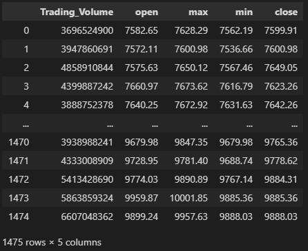
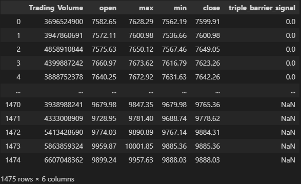
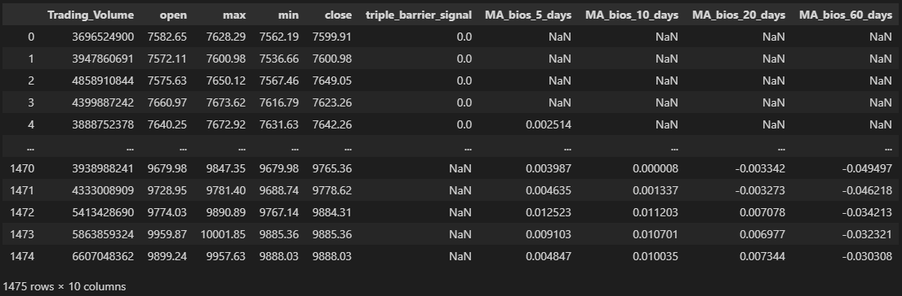
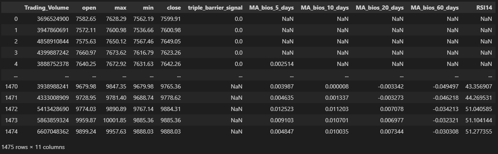
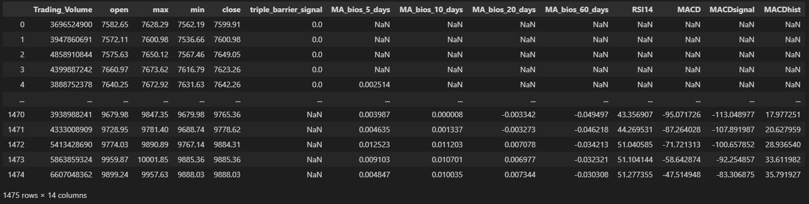
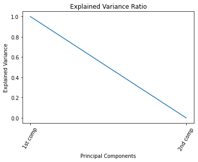
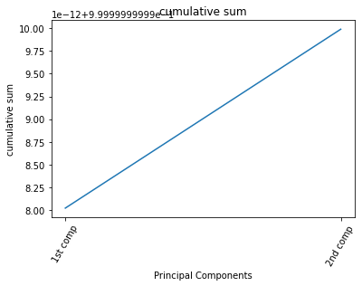
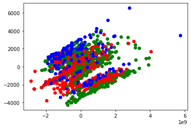

# Program HW2

## How to run my code?
    Run all the cells in HW2.ipynb file
## Problem 1 : Collect the TAIEX from 2012/12/01 to 2018/12/02 (Day Bar). The data should include open, close, high, low, volume.
```python
import requests
import pandas as pd
url = "https://api.finmindtrade.com/api/v4/data"
parameter = {
    "dataset": "TaiwanStockPrice",
    "data_id": "TAIEX",
    "start_date": "2012-12-01",
    "end_date": "2018-12-02"
}
r = requests.get(url, params=parameter)
data = r.json()
stock_deal_info = data["data"]
df_taiex=pd.DataFrame(stock_deal_info)
#print(df_taiex)
df_taiex=df_taiex.drop(columns=['date','stock_id','Trading_money', 'spread','Trading_turnover'],axis=1)
df_taiex
```



## Problem 2 : Apply the triple-barrier method to label the collected data. The upper bound is set as 4% and labeled as 1 once it is touched. The lower bound is set as 2% and labeled as 2 once it is touched. The vertical barrier is set as 20 days and labeled as 0 once it is touched.
```python
import numpy as np
label=[]
def triple_barrier(price, ub, lb):
    for i in range(price.shape[0]):
        today_price=price.iloc[i]
        for day in range(1,21):
            if(i+day)<price.shape[0]:
                compare_price=price.iloc[i+day]
                if today_price*ub<=compare_price:
                    label.append(1)
                    break
                elif today_price*lb>=compare_price:
                    label.append(2)
                    break
            if day==20:
                label.append(0)
                break
            if (i+day)==price.shape[0]:
                label.append(float("NaN"))
                break
triple_barrier(df_taiex.close, 1.04, 0.98)
triple_barrier_signal = pd.DataFrame({'triple_barrier_signal':label})
df_taiex=pd.concat([df_taiex,triple_barrier_signal["triple_barrier_signal"]],axis=1)
```

## Problem 3 : Use “close price” to calculate 8 technical indicators of collected data. The technical indicators are: 
    A. Bios of moving average: 5-days, 10-days, 20-days, 60-day. ((價格-MA)/MA) 
    B. RSI: 14 
    C. MACD(快線DIF), MACD signal(慢線), MACD histogram(柱狀) 
    D. Save problem 1, 2, 3 to a csv.
>使用talib函式庫
```
! conda install -c conda-forge ta-lib
```
### A. Bios of moving average: 5-days, 10-days, 20-days, 60-day. ((價格-MA)/MA)
```python
import talib
#5 days
MA_5_days = talib.MA(df_taiex.close, timeperiod = 5, matype = 0)
MA_bios_5_days=(df_taiex.close-MA_5_days)/MA_5_days
MA_bios_5_days = pd.DataFrame({'MA_bios_5_days':MA_bios_5_days})
df_taiex=pd.concat([df_taiex,MA_bios_5_days],axis=1)

#10 days
MA_10_days = talib.MA(df_taiex.close, timeperiod = 10, matype = 0)
MA_bios_10_days=(df_taiex.close-MA_10_days)/MA_10_days
MA_bios_10_days = pd.DataFrame({'MA_bios_10_days':MA_bios_10_days})
df_taiex=pd.concat([df_taiex,MA_bios_10_days],axis=1)

#20 days
MA_20_days = talib.MA(df_taiex.close, timeperiod = 20, matype = 0)
MA_bios_20_days=(df_taiex.close-MA_20_days)/MA_20_days
MA_bios_20_days = pd.DataFrame({'MA_bios_20_days':MA_bios_20_days})
df_taiex=pd.concat([df_taiex,MA_bios_20_days],axis=1)

#60 days
MA_60_days = talib.MA(df_taiex.close, timeperiod = 60, matype = 0)
MA_bios_60_days=(df_taiex.close-MA_60_days)/MA_60_days
MA_bios_60_days = pd.DataFrame({'MA_bios_60_days':MA_bios_60_days})
df_taiex=pd.concat([df_taiex,MA_bios_60_days],axis=1)

df_taiex
```



### B. RSI : 14
```python
RSI14=talib.RSI(df_taiex.close,14)
RSI14 = pd.DataFrame({'RSI14':RSI14})
df_taiex=pd.concat([df_taiex,RSI14],axis=1)
df_taiex
```


### C. MACD(快線DIF), MACD signal(慢線), MACD histogram(柱狀)
```python
df_taiex["MACD"],df_taiex["MACDsignal"],df_taiex["MACDhist"]=talib.MACD(df_taiex.close)
df_taiex
```


### D. Save problem 1, 2, 3 to a csv
```python
df_taiex = df_taiex.dropna()
#df_taiex
df_taiex.to_csv("TAIEX.csv")
```
## Problem 4 : Use the collected data in problem 1 and all technical indicators in problem 2 to calculate the 2 PCA component
    A. Plot the explained variance ratio and its cumulative sum. 
    B. Plot data by class labeled in problem 2. 
    C. Discuss pros and cons of PCA method in this dataset.  
### A. Plot the explained variance ratio and its cumulative sum.
```python
from sklearn.decomposition import PCA
pca = PCA(n_components=2)
pca.fit(df_taiex.drop(columns=["triple_barrier_signal"]))
print(pca.explained_variance_ratio_)
print(pca.explained_variance_ratio_.cumsum())
```
#### Explained variance ratio
```python
import matplotlib.pyplot as plt
plt.plot(pca.explained_variance_ratio_)
plt.ylabel('Explained Variance')
plt.xlabel('Principal Components')
plt.xticks(range(0,2),
           ["1st comp", "2nd comp"], rotation=60)
plt.title('Explained Variance Ratio')
plt.show()
```



#### Cumulative sum
```python
import matplotlib.pyplot as plt

plt.plot(pca.explained_variance_ratio_.cumsum())
plt.ylabel('cumulative sum')
plt.xlabel('Principal Components')
plt.xticks(range(0,2),
           ["1st comp", "2nd comp"], rotation=60)
plt.title('cumulative sum')
plt.show()
```



### B. Plot data by class labeled in problem 2.
1. PCA降維
    ```python
    X_pca=pca.transform(df_taiex.drop(columns=["triple_barrier_signal"]))
    print(X_pca.shape)
    ```
2. 畫圖
    >label0 : 紅色  
    >label1 : 藍色  
    >label2 : 綠色
    ```python
    import matplotlib.pyplot as plt
    cdict = {0: 'red', 1: 'blue', 2: 'green'}
    #print(X_pca.shape[0])
    for i in range(X_pca.shape[0]):
        #print(i)
        plt.scatter(X_pca[i, 0], X_pca[i,1], c=cdict[df_taiex["triple_barrier_signal"].iloc[i]])
    plt.show()
    ```

    

### C. Discuss pros and cons of PCA method in this dataset
    Pros : 降低資料維度，使得資料在低維度空間可以視覺化出來
    Cons : 降低維度後的資料有許多筆不同label的feature都重疊在一起，因此顯示這樣的降維方式在這個dataset中比較沒有幫助
