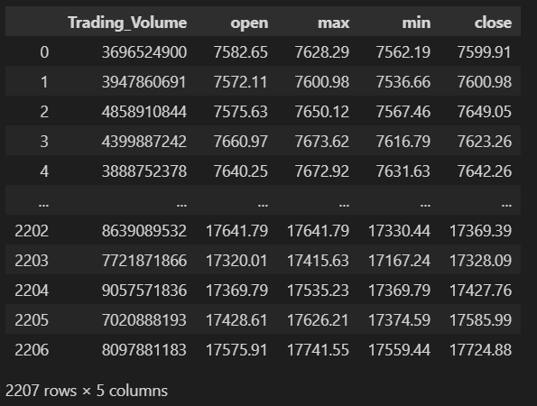
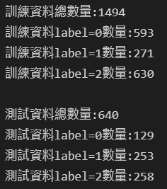
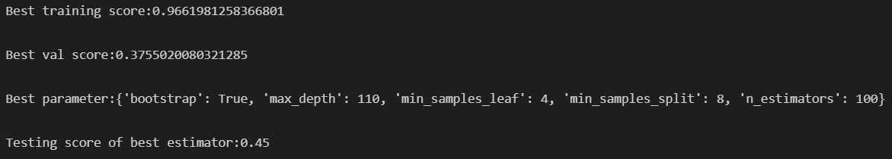
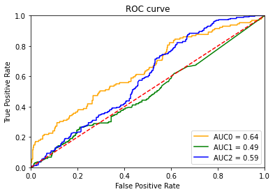

# Program HW3
## How to run my code?
> Execute all the cells in ipynb file.
## Problem1
作法同HW2，須將日期調整成2012/12/01~2021/12/02
```python
import requests
import pandas as pd
url = "https://api.finmindtrade.com/api/v4/data"
parameter = {
    "dataset": "TaiwanStockPrice",
    "data_id": "TAIEX",
    "start_date": "2012-12-01",
    "end_date": "2021-12-02"
}
r = requests.get(url, params=parameter)
data = r.json()
stock_deal_info = data["data"]
df_taiex=pd.DataFrame(stock_deal_info)
df_taiex=df_taiex.drop(columns=['date','stock_id','Trading_money', 'spread','Trading_turnover'],axis=1)
df_taiex
```

## Problem2: Use the collected and analyzed data in problem 1 to train a random forest model. And apply grid search and cross validation method to find the best parameter of trained model. 
### A. The test data is the last 30% of the original data.
```python
Train_df_taiex_x = df_taiex[:int(df_taiex.shape[0]*0.7)+1].drop(columns=["triple_barrier_signal"])
Train_df_taiex_y = df_taiex[:int(df_taiex.shape[0]*0.7)+1]["triple_barrier_signal"]
Test_df_taiex_x = df_taiex[int(df_taiex.shape[0]*0.7)+1:].drop(columns=["triple_barrier_signal"])
Test_df_taiex_y = df_taiex[int(df_taiex.shape[0]*0.7)+1:]["triple_barrier_signal"]
```
### B. The parameter are:
Grid Search要從這些hyperparameter中找到最好的hyperparameter
> i. 'bootstrap': [True], 
> ii. 'max_depth': [80, 90, 100, 110], 
> iii. 'max_features': [2, 3], 
> iv. 'min_samples_leaf': [3, 4, 5], 
> v. 'min_samples_split': [8, 10, 12], 
> vi. 'n_estimators': [100, 200, 300, 1000]
```python
param_grid={"bootstrap":[True],
            "max_depth":[80,90,100,110],
            "min_samples_leaf":[3,4,5],
            "min_samples_split":[8,10,12],
            "n_estimators":[100,200,300,1000]}

```

### C. Print the distribution of all data, training data and testing data.
```python
#Train_df_taiex_y
print("訓練資料總數量:{}".format(Train_df_taiex_y.shape[0]))
print("訓練資料label=0數量:{}".format(Train_df_taiex_y[Train_df_taiex_y==0].shape[0]))
print("訓練資料label=1數量:{}".format(Train_df_taiex_y[Train_df_taiex_y==1].shape[0]))
print("訓練資料label=2數量:{}\n".format(Train_df_taiex_y[Train_df_taiex_y==2].shape[0]))

#Test_df_taiex_y
print("測試資料總數量:{}".format(Test_df_taiex_y.shape[0]))
print("測試資料label=0數量:{}".format(Test_df_taiex_y[Test_df_taiex_y==0].shape[0]))
print("測試資料label=1數量:{}".format(Test_df_taiex_y[Test_df_taiex_y==1].shape[0]))
print("測試資料label=2數量:{}".format(Test_df_taiex_y[Test_df_taiex_y==2].shape[0]))
```

### D. Apply 3-fold cross validation and grid search to tune the hyperparameter.
宣告RamdomForest並且使用grid search找到最好的hyperparameter
```python
from sklearn.ensemble import RandomForestClassifier
from sklearn.model_selection import GridSearchCV
#randomforest
randomforest = RandomForestClassifier()
#grid search
clf = GridSearchCV(randomforest, param_grid,cv=3,return_train_score=True,n_jobs=4)
clf.fit(Train_df_taiex_x, Train_df_taiex_y)
```

### E. Print the best training score, best parameter and testing score of best estimator found from problem 2-D.
```python
print("Best training score:{}\n".format(clf.cv_results_['mean_train_score'].max()))
print("Best val score:{}\n".format(clf.best_score_))
print("Best parameter:{}\n".format(clf.best_params_))
Test_Score = clf.best_estimator_.score(Test_df_taiex_x,Test_df_taiex_y)
print("Testing score of best estimator:{}\n".format(Test_Score))
```

### F. Plot the ROC curve of the best estimator found from problem 2-D.
使用best estimator來predict test data的機率，並且根據每個類別來算ROC curve，因此總共畫出3條。
```python
from sklearn.metrics import roc_curve, roc_auc_score, auc
import matplotlib.pyplot as plt
prediction = clf.best_estimator_.predict_proba(Test_df_taiex_x)
#print(prediction)
prediction0 = prediction[:,0]
Test_df_taiex_y0 = (Test_df_taiex_y==0)
prediction1 = prediction[:,1]
Test_df_taiex_y1 = (Test_df_taiex_y==1)
prediction2 = prediction[:,2]
Test_df_taiex_y2 = (Test_df_taiex_y==2)
fpr, tpr, threshold = roc_curve(Test_df_taiex_y0, prediction0)
fpr1, tpr1, threshold1 = roc_curve(Test_df_taiex_y1, prediction1)
fpr2, tpr2, threshold2 = roc_curve(Test_df_taiex_y2, prediction2)
#print(fpr, tpr, threshold)
auc0 = auc(fpr, tpr)
auc1 = auc(fpr1, tpr1)
auc2 = auc(fpr2, tpr2)
## Plot the result
plt.title('ROC curve')
plt.plot(fpr, tpr, color = 'orange', label = 'AUC0 = %0.2f' % auc0)
plt.plot(fpr1, tpr1, color = 'green', label = 'AUC1 = %0.2f' % auc1)
plt.plot(fpr2, tpr2, color = 'blue', label = 'AUC2 = %0.2f' % auc2)
plt.legend(loc = 'lower right')
plt.plot([0, 1], [0, 1],'r--')
plt.xlim([0, 1])
plt.ylim([0, 1])
plt.ylabel('True Positive Rate')
plt.xlabel('False Positive Rate')
plt.show()   
```

